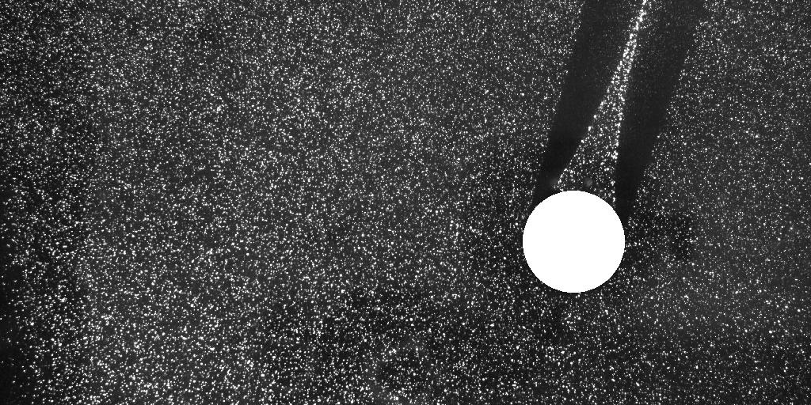

# openpiv_pivlab_comparison
discussion started on the forum about comparison with PIVLab and OpenPIV-Python, including PIVPy post-processing, see https://groups.google.com/d/msg/openpiv-users/f_-yEmx0oPQ/05D6TXeBEwAJ


## updated discussion and links to the von Karman vortices data

The discussion was renewed https://mail.google.com/mail/u/0/#inbox/FMfcgxwKjBJBRPzlQgBQPtlTtkBmjBjz
and Dr. William Thielicke released his experimental data of von Karman vortices

https://drive.google.com/drive/folders/19dANQcWhC6x_KjDnQw8kTqHHD-PXFD8A?usp=sharing



The analysis shall be something like: 
```
Analysis of the Karman images, final int area 6 pixels and 50% overlap, 
vector validation is allowed, but no smoothing after the last correlation. 
Only the circle in the middle must be masked, not the shadows. 
Then we can compare the vorticity maps (color bar scale of uncalibrated data -0.3 1/frame until +0.3 1/frame, 
color map preferably "parula", but "jet" is also ok). That might give an idea about the "quality"...?
```

